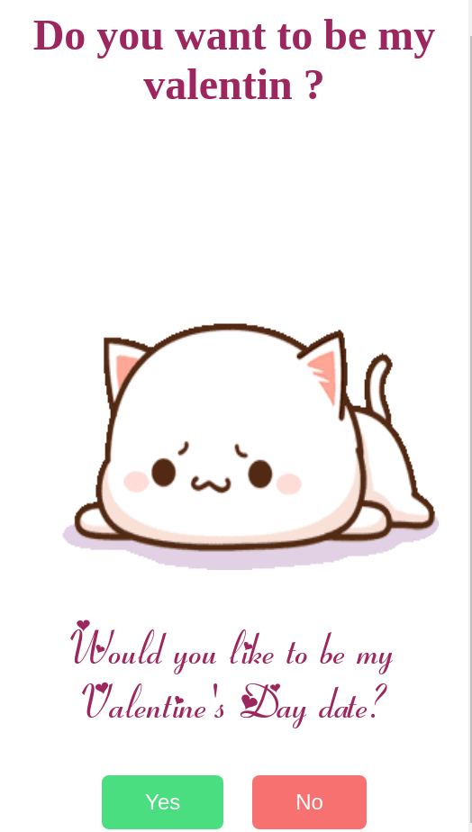

# Proyecto de san valentin

Pregunta de Amor es un juego encantador diseñado para ayudarte a expresar tus sentimientos a esa persona especial,¿Estás listo para dar el siguiente paso en tu relación y preguntarle si quiere ser tu enamorada o enamorado?.

# caracteristicas principales

1.- Cada vez que tu persona amada haga click en el boton de no, saldra una gif aleatoria y abajo con una frase preguntando de que si quieres ser su amada/o.

2.- Cuando le hagas click en el boton de si, saldra una imagen diferente pero con una gran sorpresa.

# Imagenes cuando diga que no

# Imagen cuando diga que si

